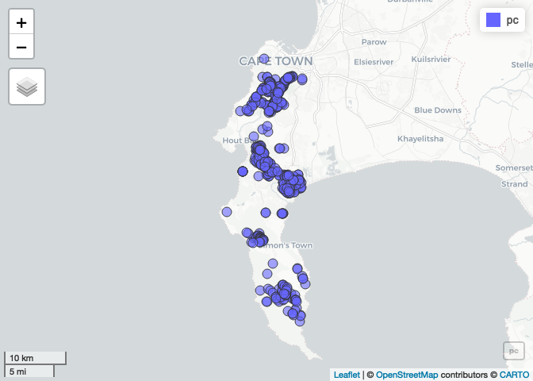

README
================
Jasper
2025-02-28

Demo for 2025 Honours class

``` r
library(rinat)
library(tidyverse)
```

    ## ── Attaching core tidyverse packages ──────────────────────── tidyverse 2.0.0 ──
    ## ✔ dplyr     1.1.4     ✔ readr     2.1.5
    ## ✔ forcats   1.0.0     ✔ stringr   1.5.1
    ## ✔ ggplot2   3.5.1     ✔ tibble    3.2.1
    ## ✔ lubridate 1.9.3     ✔ tidyr     1.3.1
    ## ✔ purrr     1.0.2     
    ## ── Conflicts ────────────────────────────────────────── tidyverse_conflicts() ──
    ## ✖ dplyr::filter() masks stats::filter()
    ## ✖ dplyr::lag()    masks stats::lag()
    ## ℹ Use the conflicted package (<http://conflicted.r-lib.org/>) to force all conflicts to become errors

``` r
library(mapview)
library(leafpop)
library(sf)
```

    ## Linking to GEOS 3.11.0, GDAL 3.5.3, PROJ 9.1.0; sf_use_s2() is TRUE

``` r
#Call the data directly from iNat
pc <- get_inat_obs(taxon_name = "Protea cynaroides",
                   bounds = c(-35, 18, -33.5, 18.5),
                   maxresults = 1000)

#Filter out bad records
pc <- pc %>% filter(positional_accuracy<46 & 
                latitude<0 &
                !is.na(latitude) &
                captive_cultivated == "false" &
                quality_grade == "research")


#Make the dataframe a spatial object of class = "sf"
pc <- st_as_sf(pc, coords = c("longitude", "latitude"), crs = 4326)

#Plot the data
mapview(pc, 
        popup = 
          popupTable(pc,
            zcol = c("user_login", "captive_cultivated", "url")))
```

<!-- -->
